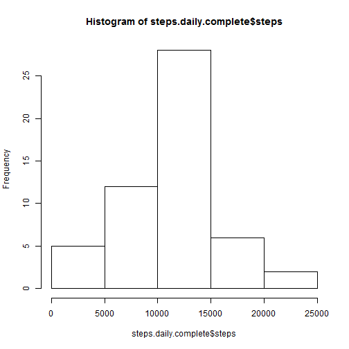
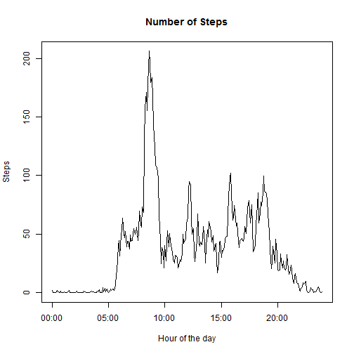
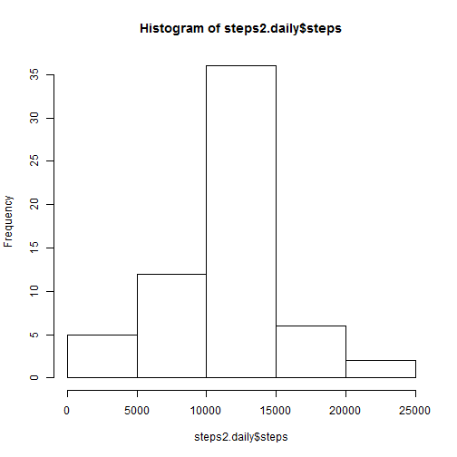
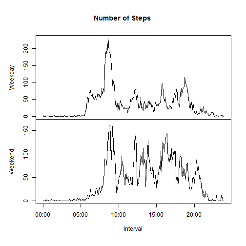

This project makes use of data from a personal activity monitoring device. This device collects data at 5 minute intervals through out the day. The data consists of two months of data from an anonymous individual collected during the months of October and November, 2012 and include the number of steps taken in 5 minute intervals each day.  
To see the output of this file, please visit http://rpubs.com/topramen/53905   


###Loading and preprocessing the data
#### 1: Load the Libraries


```r
if  (!require(lubridate)) {
  install.packages("lubridate")
  library(lubridate)
}
```

```
## Loading required package: lubridate
```

```r
if  (!require(plyr)) {
  install.packages("plyr")
  library(plyr)
}
```

```
## Loading required package: plyr
## 
## Attaching package: 'plyr'
## 
## The following object is masked from 'package:lubridate':
## 
##     here
```

```r
if  (!require(xts)){
  install.packages("xts")
  library(xts)
}
```

```
## Loading required package: xts
## Loading required package: zoo
## 
## Attaching package: 'zoo'
## 
## The following objects are masked from 'package:base':
## 
##     as.Date, as.Date.numeric
```

```r
if  (!require(reshape2)){
  install.packages("reshape2")
  library(reshape2)
}
```

```
## Loading required package: reshape2
```
####2: Read the activity data

```r
steps <- read.csv("activity.csv", stringsAsFactors=F)
names(steps)
```

```
## [1] "steps"    "date"     "interval"
```

```r
summary(steps)
```

```
##      steps           date              interval   
##  Min.   :  0.0   Length:17568       Min.   :   0  
##  1st Qu.:  0.0   Class :character   1st Qu.: 589  
##  Median :  0.0   Mode  :character   Median :1178  
##  Mean   : 37.4                      Mean   :1178  
##  3rd Qu.: 12.0                      3rd Qu.:1766  
##  Max.   :806.0                      Max.   :2355  
##  NA's   :2304
```
####3 : Process / transform the data

```r
steps$date <- ymd(steps$date)
steps.complete <- steps[complete.cases(steps),]
steps.daily.complete <- aggregate(steps ~ date, steps.complete, sum)
str(steps.daily.complete)
```

```
## 'data.frame':	53 obs. of  2 variables:
##  $ date : POSIXct, format: "2012-10-02" "2012-10-03" ...
##  $ steps: int  126 11352 12116 13294 15420 11015 12811 9900 10304 17382 ...
```

###Total number of steps taken per day
####1. histogram of daily steps

```r
hist(steps.daily.complete$steps)
```

 

###2. mean and median of daily steps

```r
mean.sdc <- mean(steps.daily.complete$steps)
mean.sdc
```

```
## [1] 10766
```

```r
median.sdc <- median(steps.daily.complete$steps)
median.sdc
```

```
## [1] 10765
```

###Average Day
####1. Which 5-minute interval, on average across all the days in the dataset, contains the maximum number of steps?

```r
avg.day <- aggregate(steps ~ interval, steps.complete, mean)
row.names(avg.day) <- ymd_hm(paste("20150101", formatC(avg.day$interval, width = 4, format = "d", flag = "0")))
max.steps.interval <- avg.day[which.max(avg.day$steps), "interval"]
max.steps.interval
```

```
## [1] 835
```
####2. Time series plot of the 5-minute interval (x-axis) and the average number of steps taken, averaged across all days (y-axis)

```r
steps <- merge (steps, avg.day, by="interval")
#remove the interval column so that this dataframe can be used as a zoo object
avg.day <- subset (avg.day, select = -c(interval))
#Time Series Plot of average day
plot.zoo(as.xts(avg.day), ylab="Steps", xlab="Hour of the day", main="Number of Steps")
```

 

###Imputing missing values
####1. Calculate and report the total number of missing values in the dataset

```r
na.rows <- is.na(steps$steps.x) 
#How many NAs are there 
sum(na.rows)
```

```
## [1] 2304
```

####2.impute the na values in a new data set

```r
#The strategy for imputing missing values is given below:  missing values are replaced from the corresponding interval in an average day . ie, if there is a missing value in interval 10, we get the #steps from interval 10 from the dataframe avg.day
steps2 <- transform(steps, steps = ifelse(na.rows, steps$steps.y, steps$steps.x))
```

####3. Create a new dataset that is equal to the original dataset but with the missing data filled in

```r
steps2 <- subset (steps2, select = -c(steps.x, steps.y))
steps2.daily <- aggregate(steps ~ date, steps2, sum)
```
####4. histogram with the imputed data

```r
hist(steps2.daily$steps)
```

 

```r
#mean and median of imputed daily steps
mean.step2.daily <- mean(steps2.daily$steps)
mean.step2.daily
```

```
## [1] 10766
```

```r
median.steps2.daily <- median(steps2.daily$steps)
median.steps2.daily
```

```
## [1] 10766
```
We see that:  
* the mean calculated with the data containing imputed values is the same as the mean calculated with the data containing NA values  
* the median calculated with the data containing imputed values is slightly higher than the median calculated with the data containing NA values  
* the mean and the median are now equal.

###Are there differences in activity patterns between weekdays and weekends?
####1. Create a new factor variable in the dataset with two levels -- "weekday" and "weekend"

```r
steps2$day <- weekdays(steps2$date)
# Does the day begin with an 's'?
steps2$isWeekend <- grepl("^S", steps2$day)
steps2$dayType <- factor(steps2$isWeekend, levels = c(F, T), labels = c("Weekday", "Weekend"))
head(steps2)
```

```
##   interval       date steps      day isWeekend dayType
## 1        0 2012-10-01 1.717   Monday     FALSE Weekday
## 2        0 2012-11-23 0.000   Friday     FALSE Weekday
## 3        0 2012-10-28 0.000   Sunday      TRUE Weekend
## 4        0 2012-11-06 0.000  Tuesday     FALSE Weekday
## 5        0 2012-11-24 0.000 Saturday      TRUE Weekend
## 6        0 2012-11-15 0.000 Thursday     FALSE Weekday
```
####2. Make a panel plot containing a time series plot of the 5-minute interval (x-axis) and the average number of steps taken, averaged across all weekday days or weekend days (y-axis)

```r
avg.day.imputed <- aggregate(steps ~ interval + dayType, steps2, mean)
avg.day.imputed <- dcast(avg.day.imputed, interval ~ dayType)
```

```
## Using steps as value column: use value.var to override.
```

```r
row.names(avg.day.imputed) <- ymd_hm(paste("20150101", formatC(avg.day.imputed$interval, width = 4, format = "d", flag = "0")))
avg.day.imputed <- subset (avg.day.imputed, select = -c(interval))
plot.zoo(as.xts(avg.day.imputed), xlab="Interval", main="Number of Steps")
```

 
